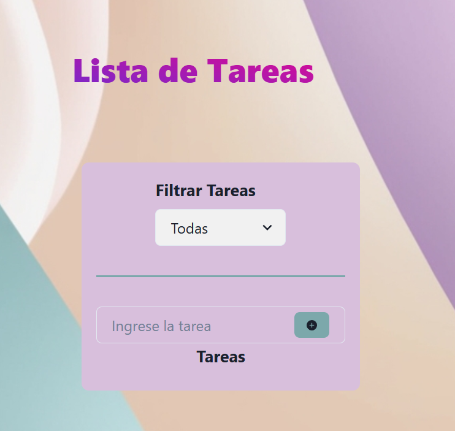
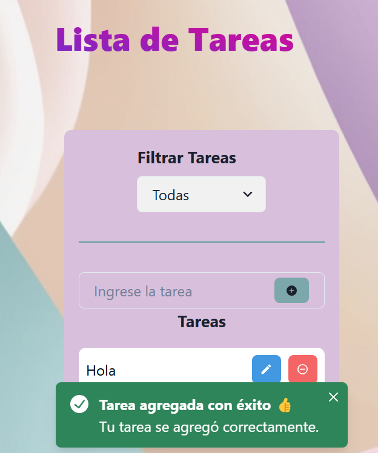
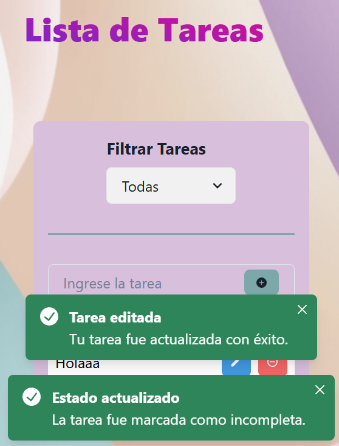
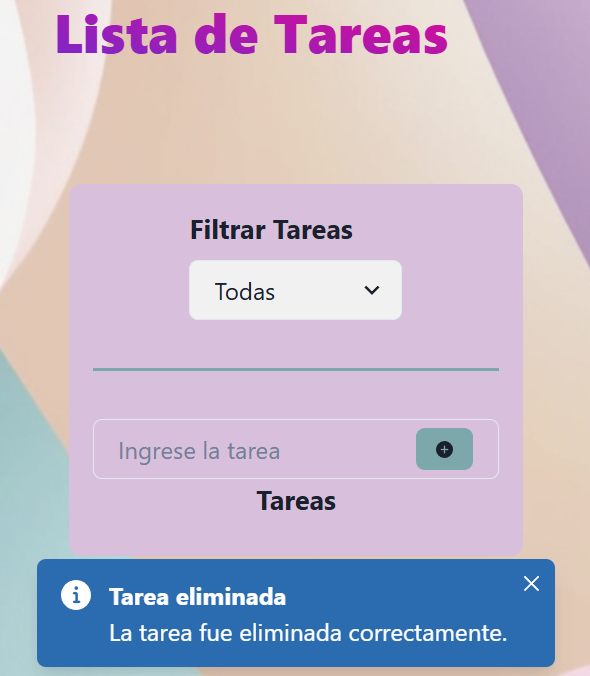

# **TodoList App** 📝

Una aplicación de lista de tareas (To-Do List) creada con **React** y **Chakra UI**. Permite a los usuarios agregar, editar, eliminar y marcar tareas como completadas de manera sencilla y visualmente atractiva.

---

## 🚀 **Características**
- **Agregar tareas: Crea tareas nuevas con validaciones para evitar entradas vacías o muy cortas.
- **Editar tareas: Modifica el contenido de tus tareas fácilmente.
- **Eliminar tareas: Elimina tareas de la lista con un solo clic.
- **Marcar como completada: Cambia el estado de las tareas y muestra un ícono de tilde (✅) cuando están completadas.
- **Interfaz amigable: Diseño moderno y responsivo utilizando Chakra UI.

---

## 🛠️ **Tecnologías utilizadas**

- **React**: Biblioteca para construir interfaces de usuario.
- **Chakra UI**: Framework de componentes estilizados para React.
- **React Icons**: Para los íconos de la interfaz.
- **LocalStorage**: Para persistir los datos de las tareas en el navegador.

---

## 📦 **Instalación**

1️⃣ **Clona el repositorio:**

git clone https://github.com/melina8444/todoList.git
cd todoList

2️⃣ Instala las dependencias:

npm install

3️⃣ Inicia el servidor de desarrollo:

npm run dev

4️⃣ Abre la aplicación en tu navegador:
http://localhost:5173/

🖼️ Capturas de pantalla

Pantalla principal

Tarea agregada con éxito

Tarea editada

Tarea completada

Tarea eliminada

📚 Cómo usar

1️⃣  Escribe una tarea en el campo de entrada y haz clic en Agregar.
2️⃣ Haz clic en una tarea para marcarla como completada o incompleta.
3️⃣  Edita o elimina tareas utilizando los botones correspondientes.

📩 Contacto

Cualquier duda o sugerencia, puedes contactarme a través de:

GitHub: [melina8444](https://github.com/melina8444/todoList)
Email: melinayanguez@gmail.com