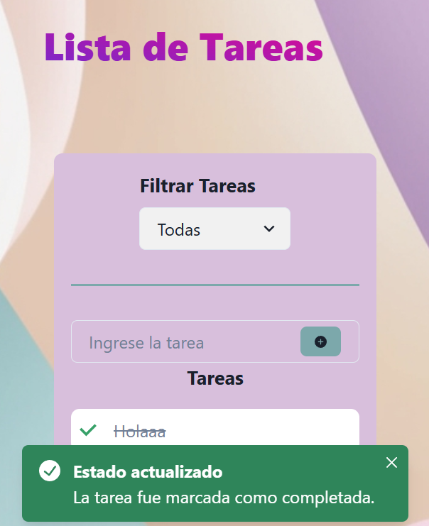

TodoList App 📝
Una aplicación de lista de tareas (To-Do List) creada con React y Chakra UI. Permite a los usuarios agregar, editar, eliminar y marcar tareas como completadas de manera sencilla y visualmente atractiva.

🚀 Características
Agregar tareas: Crea tareas nuevas con validaciones para evitar entradas vacías o muy cortas.
Editar tareas: Modifica el contenido de tus tareas fácilmente.
Eliminar tareas: Elimina tareas de la lista con un solo clic.
Marcar como completada: Cambia el estado de las tareas y muestra un ícono de tilde (✅) cuando están completadas.
Interfaz amigable: Diseño moderno y responsivo utilizando Chakra UI.

🛠️ Tecnologías utilizadas
React: Biblioteca para construir interfaces de usuario.
Chakra UI: Framework de componentes estilizados para React.
React Icons: Para los íconos de la interfaz.
LocalStorage: Para persistir los datos de las tareas en el navegador.

📦 Instalación
1) Clona el repositorio:

git clone https://github.com/melina8444/todoList.git
cd todoList

2) Instala las dependencias:

npm install

3) Inicia el servidor de desarrollo:

npm run dev

4) Abre la aplicación en tu navegador:
http://localhost:5173/

🖼️ Capturas de pantalla

📚 Cómo usar
1- Escribe una tarea en el campo de entrada y haz clic en Agregar.
2- Haz clic en una tarea para marcarla como completada o incompleta.
3- Edita o elimina tareas utilizando los botones correspondientes.

📩 Contacto
Cualquier duda o sugerencia, puedes contactarme a través de:

GitHub: [melina8444](https://github.com/melina8444/todoList)
Email: melinayanguez@gmail.com